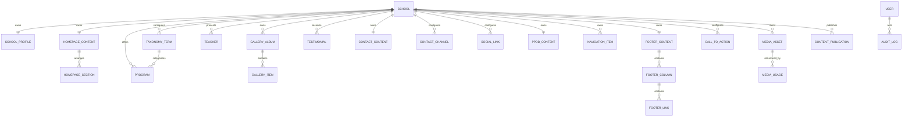

# Admin CMS Conceptual ERD

Version: 0.1
Status: APPROVED
Implementation Authority: ALLOWED
Owner: Product Owner
Date: 2026-07-20

## Scope

This is a conceptual proposal only. It does not authorize a Prisma schema change or migration. One canonical product schema and migration history are reused by many independent single-School installations; TK Islam Ar Rahmah 48 is the pilot installation. All primary entities use PostgreSQL UUIDs, retain `schoolId` for domain clarity/portability, and use `timestamptz` interpreted through the installation School timezone.

## Relationship Diagram

`SCHOOL` is the dedicated canonical installation root approved for Sprint 5.2.1. The existing pilot `SchoolSettings` record remains linked one-to-one as an additive compatibility record, preserving its API and fallback resolver. One installation has one active School; no shared-database tenant directory or membership routing is required.

## Common Fields

Every editable entity contains:

- `id UUID PK`
- `schoolId UUID FK`
- `createdAt timestamptz`
- `updatedAt timestamptz` used for optimistic concurrency
- `createdByUserId UUID`
- `updatedByUserId UUID`
- `archivedAt timestamptz nullable`
- `archivedByUserId UUID nullable`

List content additionally contains `slug varchar`, `sortOrder integer`, and `isVisible boolean`. Slug uniqueness is scoped to school and entity type.

No API accepts authoritative `schoolId` from ordinary CMS payloads. It is resolved from the installation's single School root.

Configuration over Hardcode applies to taxonomies, channels, social networks, CTAs, homepage sections, navigation locations/items, footer columns/links, and safe icon keys. These are School configuration records rather than new database columns for each variation.

## Entity Recommendations

### School

Stable installation identity: `id`, unique `schoolCode`, `schoolName`, `isActive`, `timezone`, and `locale`. `schoolCode` remains immutable after initialization. Exactly one active School root is expected per initial installation. Security configuration does not belong in public content.

### User Authorization in the Initial Model

Users and roles belong to the installation's authentication boundary. The existing User role can remain the authorization source because one installation serves one School. `SchoolMembership` is deliberately not required in Sprint 5.2; it may be introduced only if a future approved deployment model needs multiple schools or per-school membership inside one runtime.

### SchoolProfile (one-to-one)

`shortName`, `motto`, `principalName`, `principalPhotoMediaId`, `principalWelcome`, `shortProfile`, `history`, `vision`, `mission`, structured `valuesJson`, address presentation, and audit metadata. Contacts and social networks are related configuration collections, not fixed columns. Existing nullable SchoolSettings fields are migrated incrementally, not duplicated indefinitely.

### HomepageContent (one-to-one)

Container fields only: `schoolId`, publication/audit metadata, and optional page-level presentation settings. Actual homepage composition lives in ordered HomepageSection rows.

### HomepageSection (one-to-many)

`typeCode`, `title`, `label`, `sortOrder`, `isEnabled`, `configJson`, and optional appearance token. Known type codes initially include HERO, STATISTICS, PROGRAMS, TESTIMONIALS, GALLERY, PPDB, and CUSTOM, but type codes are data rather than a database enum. `configJson` is validated by a registered schema for the type code and contains references to CTA, Program, Testimonial, GalleryAlbum, and MediaAsset IDs. Unknown renderer codes cannot publish until application support exists.

### Program (one-to-many)

Sprint 5.2.5 foundation: School-unique `code` and `slug`, `title`, bounded `summary`/`description`, optional same-School `featuredMediaId`, `sortOrder`, `isActive`, and timestamps. Taxonomy, structured objective/activity/benefit collections, frequency, featured placement, and publishing lifecycle remain additive future layers.

### TaxonomyTerm (one-to-many)

`namespace`, `code`, `label`, optional `description`, safe `iconKey`, `sortOrder`, `isVisible`. Unique `(schoolId, namespace, code)`. Namespaces initially include `PROGRAM_CATEGORY`, `GALLERY_CATEGORY`, `TESTIMONIAL_SOURCE`, and may expand without adding columns or enums.

### Teacher (one-to-many)

Sprint 5.2.5 foundation: `name`, optional `position`, `biography`, `qualification`, optional same-School `photoMediaId`, `sortOrder`, `isActive`, and timestamps. This is public presentation only, is not linked to authentication User, and stores no payroll or employment-sensitive data.

### GalleryAlbum and GalleryItem (one-to-many)

Album foundation: School-unique `slug`, `title`, optional `description`, optional same-School `coverMediaId`, `sortOrder`, `isActive`, and timestamps. Event/category/publishing fields remain deferred.

Item foundation: canonical `schoolId`, `albumId`, same-School `mediaId`, optional `caption`, `sortOrder`, `isActive`, and timestamps. Unique `(albumId, mediaId)` rejects duplicate use of the same media in one album as explicitly decided for Sprint 5.2.5.

### Testimonial (one-to-many)

Sprint 5.2.5 foundation: `authorName`, optional `authorRole`, bounded plain-text `quote`, optional same-School `avatarMediaId`, `sortOrder`, `isActive`, and timestamps. Source taxonomy, consent evidence, and publication lifecycle remain required future additions before publishing.

### ContactContent (one-to-one)

`address`, `googleMapsUrl`, and structured `operatingHoursJson`. Communication methods and social networks are separate related collections.

### ContactChannel and SocialLink (one-to-many)

Sprint 5.2.3 implementation: ContactChannel uses UUID, `schoolId`, allowlisted `typeCode`, `label`, `value`, optional safe `url`, `sortOrder`, explicit `isActive`, actor metadata, and timestamps. SocialLink uses UUID, `schoolId`, allowlisted `platformCode`, `label`, safe `url`, `sortOrder`, explicit `isActive`, actor metadata, and timestamps. Uniqueness is `(schoolId, typeCode)` and `(schoolId, platformCode)`. The initial allowlists are application registries rather than database enums, so an approved additive registry update does not require migration.

### PpdbContent (one-to-one)

`isOpen`, `academicYearLabel`, `title`, `description`, ordered requirement/step configuration, CTA references, ContactChannel references, available Program references, and audit metadata. It contains no applicant rows and does not assume WhatsApp is the only contact method.

### NavigationItem (one-to-many) and FooterContent (one-to-one)

Navigation item: `label`, `href`, configurable `locationCode`, safe `iconKey`, `sortOrder`, `isVisible`, `isExternal`. FooterContent: `description`, `copyright`, and presentation settings. FooterColumn: `title`, `typeCode`, `sortOrder`, `isVisible`. FooterLink: `columnId`, `label`, target/reference, `sortOrder`, and visibility. Columns may reference ContactChannel, SocialLink, CTA, NavigationItem, or safe URLs. Login entry is system-defined and cannot be repointed by School Admin.

### CallToAction (one-to-many)

Sprint 5.2.3 implementation uses UUID, `schoolId`, safe configurable `code`, `label`, safe `targetUrl`, optional structured-text `description`, `sortOrder`, explicit `isActive`, actor metadata, and timestamps. Uniqueness is `(schoolId, code)`. CTA instances remain reusable by later homepage, PPDB, navigation, and footer milestones. Presentation tokens and icons are deferred until a consuming domain defines their approved allowlist.

### MediaAsset (one-to-many)

Sprint 5.2.4 foundation uses UUID `id`, canonical UUID `schoolId`, `storageProvider`, opaque server-generated `storageKey`, sanitized `originalFilename`, `mimeType`, `sizeBytes`, optional `width`/`height`, optional `altText`/`caption`, SHA-256 `checksum`, status (`PENDING`, `READY`, `ACTIVE`, `ARCHIVED`, `FAILED`), UUID `createdBy`, `createdAt`, and optimistic-concurrency `updatedAt`. PostgreSQL stores metadata only. Uniqueness is `(schoolId, storageKey)` with scoped status/createdAt and checksum indexes. Public URL persistence, replacement, and usage tracking remain deferred.

### MediaUsage (one-to-many)

`mediaAssetId`, `entityType`, `entityId`, `fieldName`, timestamps. It supports deletion safety and usage reporting without relying only on JSON searches.

### ContentPublication (immutable snapshot history)

Sprint 5.2.6: immutable history rows contain `id`, `schoolId`, `entityType`, `entityId`, optional `slug`, allowlisted `payload`, monotonic entity `version`, `sourceUpdatedAt`, `publishedAt`, `publishedByUserId`, and `createdAt`. Multiple snapshots per entity are retained; uniqueness is `(schoolId, entityType, entityId, version)`.

### ContentPublicationHead

One current-public pointer per `(schoolId, entityType, entityId)`. Its composite foreign key proves that the referenced immutable publication has the same School, type, and entity. Republish moves this pointer atomically; unpublish deletes it without mutating history. Gallery Item has no head because Gallery Album is its aggregate publication root.

### AuditLog

Extend the current audit relationship so CMS entities can be logged without a foreign key restricted to SchoolSettings. Proposed fields remain `actorUserId`, `action`, `entityType`, `entityId`, `beforeData`, `afterData`, `requestId`, `createdAt`. Audit retention is unlimited.

## Indexes and Constraints

- Unique: `(schoolId, slug)` on Program and GalleryAlbum.
- Unique: `(schoolId, namespace, code)` on TaxonomyTerm and `(schoolId, code)` on CallToAction.
- Unique: `(schoolId)` on each singleton content entity.
- Unique: `(schoolId, entityType, entityId, version)` on ContentPublication.
- Unique: `(schoolId, entityType, entityId)` on ContentPublicationHead.
- Composite foreign key: ContentPublicationHead current pointer must match the referenced publication's `schoolId`, `entityType`, and `entityId`.
- Index: `(schoolId, archivedAt, sortOrder)` on list/configuration entities.
- Index: `(albumId, sortOrder)` on GalleryItem.
- Index: `(schoolId, status, createdAt)` and checksum on MediaAsset.
- Index: `(entityType, entityId)` on MediaUsage and AuditLog.
- Check: nonnegative `sortOrder`, positive media dimensions/size when present.

## Deletion Policy

- Published entities: archive only.
- Never-published, unreferenced drafts: Super Admin may hard delete.
- Media: archive first; physical deletion only after zero usages, retention window, and provider success.
- AuditLog and ContentPublication are not cascade-deleted by routine CMS actions.

## Migration Principles for Sprint 5.2+

1. Add tables without dropping current SchoolSettings fields.
2. Backfill working copies from approved static content in an idempotent script.
3. Publish only after preview and visual regression approval.
4. Switch public resolvers domain by domain with fallback.
5. Remove obsolete static sources only in a later approved cleanup.
