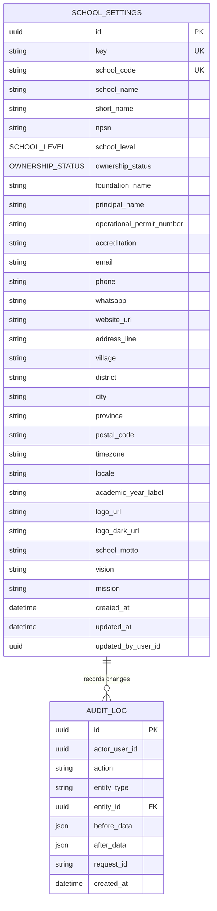

# Entity Relationship Diagram

## Document Status

- Version: 1.1
- Status: **APPROVED**
- Document Owner: Product Owner
- Prepared By: Codex based on Product Owner locked decisions
- Approved By: Product Owner
- Approval Date: 2026-07-19
- Implementation Authority: **ALLOWED**

> Sprint 4.3 amendment: `principalName`, contact/address fields, school enums, academic-year label, and public content are nullable. `isActive` is required technical identity state. Migration `20260719010000_dynamic_school_content` is authoritative.

## Data Modelling Principles

- Target database PostgreSQL dengan Prisma ORM.
- Implementasi awal single-school menggunakan singleton key stabil.
- UUID menjadi primary key entity.
- Nullability mengikuti field catalogue.
- Migration harus additive/non-destructive; tidak boleh reset atau force push production.
- Authentication user table belum ditentukan. Actor disimpan sebagai logical reference.

## Entity List

1. `SCHOOL_SETTINGS` — aggregate root dan singleton konfigurasi sekolah utama.
2. `AUDIT_LOG` — catatan append-only atas perubahan settings berhasil.

## Entity Definitions

Application/API camelCase maps to database snake_case, including `schoolCode → school_code`, `logoDarkUrl → logo_dark_url`, `schoolMotto → school_motto`, `vision → vision`, and `mission → mission`.

### SCHOOL_SETTINGS

| Column | Data type | Nullable | Default/constraint | Editable |
| --- | --- | ---: | --- | ---: |
| id | UUID | Tidak | Primary key | Tidak |
| key | VARCHAR | Tidak | Unique; `PRIMARY_SCHOOL` | Tidak |
| school_code | VARCHAR(20) | Tidak | Unique identity; normalized before insert | Tidak setelah provisioning |
| school_name | VARCHAR(150) | Tidak | Length 3–150 | Ya |
| short_name | VARCHAR(50) | Ya | — | Ya |
| npsn | VARCHAR(8) | Ya | Exactly 8 numeric digits when present | Ya |
| school_level | SCHOOL_LEVEL | Tidak | `PAUD_TK` | Ya |
| ownership_status | OWNERSHIP_STATUS | Tidak | `PRIVATE` | Ya |
| foundation_name | VARCHAR | Ya | — | Ya |
| principal_name | VARCHAR(120) | Tidak | Length 2–120 | Ya |
| operational_permit_number | VARCHAR | Ya | — | Ya |
| accreditation | VARCHAR | Ya | — | Ya |
| email | VARCHAR | Ya | Lowercase valid email | Ya |
| phone | VARCHAR(15) | Ya | Normalized 8–15 digits | Ya |
| whatsapp | VARCHAR(15) | Tidak | Normalized 10–15 digits | Ya |
| website_url | VARCHAR | Ya | HTTP/HTTPS URL | Ya |
| address_line | VARCHAR(250) | Tidak | Length 5–250 | Ya |
| village | VARCHAR | Ya | — | Ya |
| district | VARCHAR | Ya | — | Ya |
| city | VARCHAR(100) | Tidak | Max 100 | Ya |
| province | VARCHAR(100) | Tidak | Max 100 | Ya |
| postal_code | VARCHAR(5) | Ya | Exactly 5 digits | Ya |
| timezone | VARCHAR | Tidak | `Asia/Jakarta`; supported IANA value | Ya |
| locale | VARCHAR | Tidak | `id-ID` only | Ya |
| academic_year_label | VARCHAR(9) | Tidak | Sequential `YYYY/YYYY` | Ya |
| logo_url | VARCHAR | Ya | Relative path or HTTP/HTTPS URL | Ya |
| logo_dark_url | VARCHAR | Ya | Relative path or HTTP/HTTPS URL | Ya |
| school_motto | TEXT | Ya | Trimmed; empty normalized to null | Ya |
| vision | TEXT | Ya | Trimmed; empty normalized to null | Ya |
| mission | TEXT | Ya | Trimmed; empty normalized to null | Ya |
| created_at | TIMESTAMPTZ | Tidak | Creation timestamp | Tidak |
| updated_at | TIMESTAMPTZ | Tidak | Update timestamp | Tidak |
| updated_by_user_id | UUID | Ya | Logical Better Auth user reference | Tidak |

### AUDIT_LOG

| Column | Data type | Nullable | Constraint |
| --- | --- | ---: | --- |
| id | UUID | Tidak | Primary key |
| actor_user_id | UUID | Tidak | Logical Better Auth user reference |
| action | VARCHAR | Tidak | `SCHOOL_SETTINGS_INITIALIZED` or `SCHOOL_SETTINGS_UPDATED` |
| entity_type | VARCHAR | Tidak | `SchoolSettings` |
| entity_id | UUID | Tidak | References School Settings identity logically/physically |
| before_data | JSONB | Ya | Null only for initialize; state before update otherwise |
| after_data | JSONB | Tidak | State after update; no secrets |
| request_id | VARCHAR | Tidak | Request correlation ID |
| created_at | TIMESTAMPTZ | Tidak | Creation timestamp |

## Enums

```text
SCHOOL_LEVEL = PAUD_TK | TK | PAUD
OWNERSHIP_STATUS = PRIVATE | PUBLIC
```

## Relationships

- One School Settings entity may be referenced by many Audit Log records.
- `updated_by_user_id` and `actor_user_id` are UUID logical references to Better Auth users. A physical foreign key depends on the approved Better Auth adapter schema.
- No user table is introduced in Sprint 4.1B.

## Cardinality

```text
SCHOOL_SETTINGS ||--o{ AUDIT_LOG : "has change history"
```

## Constraints

- Primary keys: `school_settings.id`, `audit_log.id`.
- Unique constraint: `school_settings.key`.
- Unique constraint: `school_settings.school_code` as school identity.
- `school_code` is stored uppercase, 2–20 characters, and matches `^[A-Z0-9_-]+$`.
- Singleton business value: exactly `PRIMARY_SCHOOL` for the initial installation.
- Database enum or Prisma enum for school level and ownership status.
- Required columns use NOT NULL.
- Audit rows are append-only; update/delete is not exposed by application UI or API.
- `school_code` is immutable after initial provisioning.

## Indexes

- Unique index on `school_settings.key`.
- Unique index on `school_settings.school_code`.
- Index on `audit_log.entity_id, audit_log.created_at` for history lookup.
- Index on `audit_log.request_id` for trace correlation.
- Optional index on `audit_log.actor_user_id, audit_log.created_at` when auth ID type is finalized.

## Singleton Rules

- Application reads and updates by `key = "PRIMARY_SCHOOL"`, never by “first row”.
- No create or delete endpoint exists.
- PATCH cannot alter `id` or `key`.
- Unique key prevents duplicate primary-school rows.

## Audit Columns

- School Settings: `created_at`, `updated_at`, `updated_by_user_id`.
- Audit Log: `actor_user_id`, `request_id`, `created_at`, immutable before/after JSON.

## Data Retention

AuditLog retention is unlimited. The application does not provide automated deletion or data-retention cleanup for audit records.

## Mermaid ER Diagram



## Migration Notes

- Schema migration introduces enums, `school_settings`, unique singleton and school-code keys, `audit_log`, and indexes through an additive Prisma migration.
- Do not drop or alter public-site data.
- Do not use `prisma db push`, database reset, or destructive production migration.
- Schema migration creates no production School Settings record and contains no placeholder business data.
- Separate idempotent provisioning creates `PRIMARY_SCHOOL` after validating all mandatory values, either through `npm run setup:school` or an equivalent secure server-side mechanism.
- Provisioning checks existence, rejects a second record, and atomically writes `SCHOOL_SETTINGS_INITIALIZED`; `before_data` is null and `after_data` contains initialized data.
- Transaction should update School Settings and append AuditLog atomically when supported.

## Optimistic Concurrency

The persisted `updated_at` column is the concurrency token. PATCH supplies `expectedUpdatedAt`; the transaction updates only when stored `updated_at` equals that value. A mismatch returns 409 and writes neither settings changes nor a success audit record.

## Open Issues

None.

## Approval Record

Approved by Product Owner on 2026-07-19.

## Change Log

| Version | Date | Author | Change | Status |
| --- | --- | --- | --- | --- |
| 1.0 | 2026-07-19 | Codex | Schema migration separated from idempotent singleton provisioning; approved | APPROVED |
